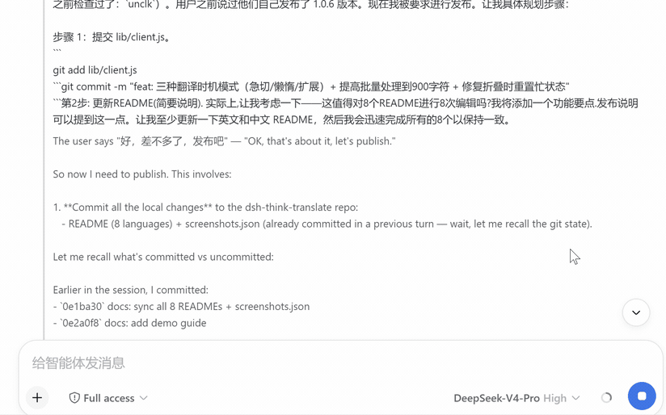
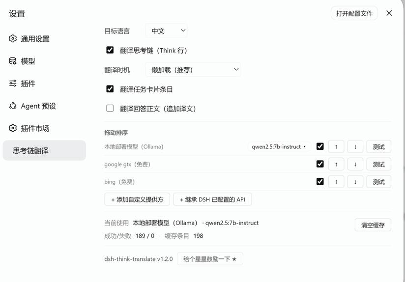

<div align="center">

# 🐋 dsh-think-translate

**Languages:** [English](README.md) · [中文](README.zh-CN.md) · [日本語](README.ja.md) · [한국어](README.ko.md) · [Español](README.es.md) · [Français](README.fr.md) · [Deutsch](README.de.md) · [Русский](README.ru.md)

[](https://www.npmjs.com/package/dsh-think-translate)
[](LICENSE)
[](https://github.com/deepseek-ai/deepseek-harness)




</div>

---

Translate the **reasoning / thinking chain (chain-of-thought), task cards and answers** of the [DeepSeek Harness](https://github.com/deepseek-ai/deepseek-harness) Web UI into one of **8 target languages** — in real time, on the display layer only. The originals stay untouched in the transcript, and the translated text **never enters the model context**.

## ✨ Why dsh-think-translate

DeepSeek-class models often reason in Chinese — or in whatever language they happen to think in. dsh-think-translate renders the **Think row, task cards and answer** in *your* language while you watch, like subtitles for the model's thinking.

- **🕵️ Read any thinking chain** — reasoning, chain-of-thought, task cards and answers translated in real time, streamed batch by batch
- **🌍 8 languages, one consistent UI** — 中文 / English / 日本語 / 한국어 / Español / Français / Deutsch / Русский; the settings panel, thinking rows and task cards all follow your choice, and it persists across reloads
- **🔗 Dynamic provider chain** — order providers by drag-and-drop, enable/disable each one, and set an independent fallback chain. Built-ins (google gtx, bing, local Ollama) plus any number of custom providers
- **🔌 Custom providers (OpenAI & Anthropic)** — add arbitrary OpenAI-compatible endpoints (any `/v1/chat/completions` gateway) or native **Anthropic Messages API** endpoints (Claude) from the settings panel: name, type, base URL, API key, model
- **🪄 DSH provider discovery** — providers already configured in DSH's `settings.yaml` (`llm-pi-ai.providers`, e.g. linuxdo-hub, coding-hub) are auto-discovered and appear in the chain as read-only "DSH" entries; keys are resolved from `.credentials.yaml` at runtime and never written to the plugin's config
- **🔒 Private & offline-first** — local Ollama (qwen2.5:7b / 14b or custom) is a first-class provider: free, unlimited, nothing leaves your machine. First local-model selection **auto-downloads** the model with a live progress bar and enables it when done
- **🧠 Zero context cost** — pure display layer: the model still sees the original text, and translated text never consumes the context window
- **☁️ Google / Bing fallback** — automatic switch when other providers are unavailable (google goes through a Node CONNECT tunnel using the system proxy, bypassing anti-bot blocks)
- **🛡️ Code-safe** — file paths, commands, URLs, regexes and pure-code lines are never translated
- **🧩 Paragraph & sentence-aware chunking** — long thinking chains are split on blank lines (paragraph structure preserved) and further batched by sentence, so even a small local model keeps quality
- **⏱️ Resilient** — 3× backoff retries, per-provider test buttons, failed results never cached
- **🎚️ Adjustable translation timing** — pre-translate everything, lazy-load historical chains (default), or translate only the expanded chain

## 📦 Installation

```bash
# Option 1: npm (recommended)
dsh plugin --profile web add dsh-think-translate
# then restart web

# Option 2: GitHub
dsh plugin --profile web add github:UncleK/dsh-think-translate

# Option 3: manual (junction + patch)
#  1. link the package into the profile's node_modules
New-Item -ItemType Junction -Path "$HOME\.dsh\profiles\node_modules\dsh-think-translate" `
  -Target "<repo path>"
#  2. add to "$HOME\.dsh\profiles\web\cordis.patch.yml":
# - insert:
#     - id: dsh-think-translate
#       name: dsh-think-translate
#  3. restart web
```

## 🚀 Usage

1. Open **Settings → Think Translation**
2. Pick the **target language** (e.g. 日本語) — the settings panel, thinking rows and task cards all switch to it
3. **Manage the provider chain** (drag to reorder):
   - Built-ins: **google gtx / bing** (free, works out of the box via system proxy) and **local Ollama** — on first local-model selection a download prompt appears (qwen2.5:7b / 14b or custom); it auto-enables when finished
   - **DSH providers**: endpoints already configured in DSH (`llm-pi-ai.providers`) appear automatically as read-only entries (badge "DSH"); enable them to route translation through your existing gateway accounts
   - **Custom providers**: click "Add custom provider" to register any OpenAI-compatible endpoint or a native Anthropic Messages endpoint (base URL, API key, model); each row has a **test** button to verify it live
   - Use the **fallback chain** toggle to keep a backup set (e.g. google/bing) when the primary chain fails
4. Send a message that makes the model think, then expand the **Think row** to read the translation and compare with the original

## ⚙️ How it works

```
browser → POST /_xlate/translate (same-origin, no CORS)
  → host provider chain (fail-open, user-ordered):
      chain: [provider1, provider2, ...]   ← drag-reordered in settings
        each provider is one of:
          google   (gtx via Node CONNECT tunnel / curl through system proxy)
          bing     (ttranslatev3 via curl)
          openai   (OpenAI-compatible /chat/completions — Ollama local or any gateway)
          anthropic(Anthropic Messages API /v1/messages)
      fallback chain (independent, e.g. google/bing) tried when the primary chain fails
  → browser-direct fallback
```

- **Provider config** lives in `config.json` (runtime, gitignored): `chain` (ordered ids), `fallback` (enabled + chain), `providers` (per-provider `type`/`enabled`/`baseURL`/`apiKey`/`model`/`apiKeyEnv`). Old `priority`-based configs auto-migrate.
- **DSH discovery** reads the harness `settings.yaml` (`llm-pi-ai.providers`) and `.credentials.yaml` (`refs`) on load; discovered providers are marked `source: "dsh"`, resolved keys stay in memory (never written to `config.json`), and a `/_xlate/dsh-scan` route re-reads them on demand.
- **Host half** (`lib/index.js`): provider adapters, ordered chain + fallback execution, LRU cache (600), per-provider override for tests, `/_xlate/models` listing, `/_xlate/model/pull` + `pull-status` model download management (auto-configures on completion)
- **Client half** (`lib/client.js`): 8-language UI, drag-reorderable provider list, add/edit/delete custom providers, per-provider test buttons, sentence/paragraph-batched translation, streaming Think rows, localStorage persistence (settings + translation cache)
- Pure display layer: originals remain in the transcript and model context

## 🛠 Development

- No build step: `lib/client.js` is the browser bundle (source = artifact), `lib/index.js` is the host ESM
- Client changes apply on page refresh; host changes need a web restart
- The 8-language strings live in the `UI_TEXT` dictionary in `lib/client.js`

## 📄 License

MIT
